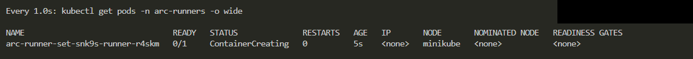

# Terraform GitHub Actions Runner Controller on Kubernetes

Deploy GitHub Actions Runner Controller (ARC) to a Kubernetes cluster with Terraform and Helm. ARC creates self-hosted runner pods for jobs from the configured GitHub repository.

## Prerequisites

- A running Kubernetes cluster with `~/.kube/config` configured
- Terraform and `kubectl`
- A GitHub token with permission to register runners

## Deploy

Set the repository URL and token as environment variables, then apply the Terraform configuration:

```bash
export TF_VAR_github_url="https://github.com/OWNER/REPOSITORY"
export TF_VAR_github_token="YOUR_TOKEN"

terraform init
terraform apply
```

The token is sensitive. Do not commit it or include it in source files.

## Run the Demo

The example workflow is [`git-acr-demo.yml`](../.github/workflows/git-acr-demo.yml). It targets the `arc-runner-set` scale set:

```yaml
runs-on: arc-runner-set
```

Trigger it manually from the repository's **Actions** tab. GitHub displays the workflow and logs, while the job runs in a temporary runner pod in Kubernetes.

Successful run: [Actions Runner Controller Demo](https://github.com/Alyzbane/projects/actions/runs/34825440402/job/103916389715)

## Check the Cluster

```bash
kubectl get pods -n arc-systems
kubectl get pods -n arc-runners
```

Runner pods are created when a job is queued and usually removed after the job completes.



## Cleanup

```bash
terraform destroy
unset TF_VAR_github_url TF_VAR_github_token
```