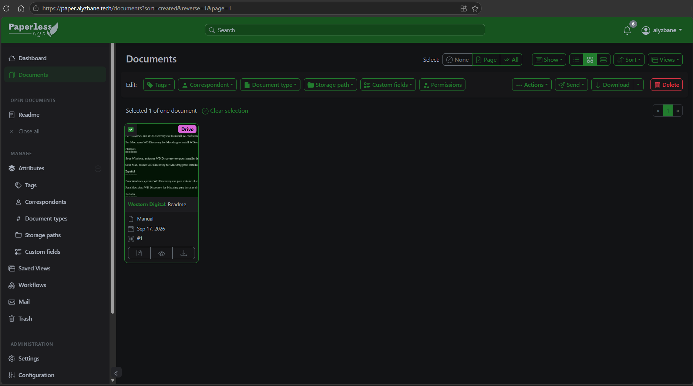

# PaperCloud

## Overview

PaperCloud deploys a small Paperless-ngx installation on AWS using Terraform. The application runs on Amazon ECS Fargate behind an HTTPS Application Load Balancer, with PostgreSQL on Amazon RDS, persistent files on Amazon EFS, and supporting services running as ECS sidecars.

This configuration is intended as a cost-conscious personal or demonstration deployment. The ECS task runs in private subnets without a public IP, using one shared NAT Gateway for outbound access. Review the security, availability, backup, and cost settings before using it for production workloads.

## Goals

- Deploy Paperless-ngx on ECS Fargate.
- Provide HTTPS access using ACM, Route 53, and an Application Load Balancer.
- Store the Paperless database in PostgreSQL 17 on Amazon RDS.
- Persist Paperless data, media, consume, and export directories on encrypted Amazon EFS.
- Run Valkey, Apache Tika, and Gotenberg alongside Paperless-ngx.
- Restrict administrative and user-management paths to configured CIDR ranges.

## Architecture

```text
Route 53
	│
	▼
ACM certificate ──► HTTPS Application Load Balancer
												 ├── /admin/* and protected API paths
												 │     ├── allowed CIDRs → ECS service
												 │     └── other sources → HTTP 403
												 └── all other paths → ECS service

VPC
	├── Public subnets
	│     ├── Application Load Balancer
	│     └── One NAT Gateway
	└── Private subnets
	      ├── ECS Fargate task
	      │     ├── Paperless-ngx
	      │     ├── Valkey
	      │     ├── Apache Tika
	      │     └── Gotenberg
	      ├── RDS PostgreSQL 17
	      └── EFS mount targets

Secrets Manager
	├── RDS master-user secret managed by RDS
	└── Paperless secret key
```

The deployment uses two Availability Zones, one shared NAT Gateway, and enables ECS deployment rollback through the deployment circuit breaker.

## Repo Structure

- `Makefile`: Terraform commands using `terraform/terraform.tfvars`.
- `README.md`: project documentation.
- `images/image.png`: Paperless-ngx deployment screenshot.
- `terraform/main.tf`: VPC, ALB, ACM, Route 53, ECS, RDS, EFS, security groups, and secrets.
- `terraform/variables.tf`: configurable deployment inputs.
- `terraform/terraform.tfvars.example`: example variable values.
- `terraform/terraform.tfvars`: local deployment values; keep it private and do not commit secrets.
- `terraform/locals.tf`: derived names, URL, hosted-zone selection, and protected paths.
- `terraform/outputs.tf`: application URL, ALB DNS name, Route 53 name servers, and RDS endpoint.
- `terraform/versions.tf`: Terraform and provider version constraints.

## Prerequisites

- An AWS account with permissions to create VPC, ECS, ALB, ACM, Route 53, RDS, EFS, Secrets Manager, IAM, and CloudWatch resources.
- AWS credentials configured for the target account and region.
- Terraform `1.16.0` or newer.
- A registered domain name.
- An existing Route 53 public hosted zone, or permission to create one.
- A public IPv4 CIDR range allowed to access protected Paperless paths.

## Deployment

### 1) Configure variables

```bash
cp terraform/terraform.tfvars.example terraform/terraform.tfvars
```

Set `domain_name`, `admin_allowed_cidrs`, and either leave `route53_zone_id` as `null` to create a hosted zone or provide an existing Route 53 zone ID. `route53_zone_name` can be set when the existing zone name differs from `domain_name`.

For example:

```hcl
domain_name = "paper.example.com"

admin_allowed_cidrs = [
	"203.0.113.10/32",
]
```

The Makefile passes `-var-file=terraform.tfvars` to Terraform.

### 2) Initialize and review

```bash
make init
make fmt
make validate
make plan
```

### 3) One-time DNS delegation setup

If Terraform creates a dedicated hosted zone for a subdomain such as `paper.example.com`, complete the following steps before the full `make apply`. This is not required when `route53_zone_id` points to an existing authoritative hosted zone.

#### Why It Gets Stuck

`aws_acm_certificate_validation` waits for ACM to confirm that the DNS validation CNAME is publicly resolvable. If the subdomain's `NS` delegation has not been added to the parent DNS zone, ACM cannot see the CNAME. Terraform then waits until validation times out and the apply fails.

#### Step 1: Apply only the hosted zone

From the repository root, run:

```bash
make dns-zone
```

Terraform will create the hosted zone and print its four name servers. Retrieve them again with:

```bash
terraform -chdir=terraform output route53_name_servers
```

#### Step 2: Register the NS records in the parent DNS

Go to the DNS provider managing `example.com` and add four `NS` records for `paper.example.com`, pointing to the four Route 53 name servers returned in Step 1. This is the one unavoidable manual step when delegating a subdomain to Route 53.

If the parent domain is already managed by Route 53, add the delegation records to the parent hosted zone there. If the parent domain is managed elsewhere, add them at that DNS provider instead.

#### Step 3: Verify propagation

Wait until the delegation is visible publicly, then run:

```bash
dig NS paper.example.com
```

Sample Output:
```bash
...

;; ANSWER SECTION:
paper.example.com.    86400   IN      NS      ns-1234.awsdns-12.co.uk.
paper.example.com.    86400   IN      NS      ns-123.awsdns-12.com.
paper.example.com.    86400   IN      NS      ns-123.awsdns-12.net.
paper.example.com.    86400   IN      NS      ns-1234.awsdns-12.org.

...
```

The response should contain the Route 53 name servers returned in Step 1. DNS propagation can take time depending on the parent zone's TTL.

### 4) Deploy

After DNS delegation has propagated, or immediately when using an existing authoritative Route 53 zone, run:

```bash
make apply
```

Terraform can now create the ACM validation CNAME in the delegated Route 53 zone, and ACM can resolve it. Certificate validation should complete without timing out.

### 5) Get the application URL

```bash
make output
```

If Terraform created the hosted zone, delegate the displayed `route53_name_servers` at your domain registrar. Then open the displayed `paperless_url` and complete the initial Paperless administrator setup.

## Validation

Check the Terraform configuration and planned changes before applying:

```bash
make validate
make plan
```

After deployment, verify:

- `paperless_url` resolves to the configured domain.
- HTTP redirects to HTTPS.
- The Paperless-ngx login page loads over HTTPS.
- Protected paths such as `/admin/` are accessible from an address in `admin_allowed_cidrs` and return `403` from other addresses.
- ECS reports a healthy service and task.
- RDS and EFS remain reachable from the ECS security group.

Useful outputs:

```bash
terraform -chdir=terraform output paperless_url
terraform -chdir=terraform output alb_dns_name
terraform -chdir=terraform output route53_name_servers
```

## Screenshots

Paperless-ngx deployed through the AWS-hosted HTTPS endpoint:



## Cleanup

Destroy the infrastructure when it is no longer needed:

```bash
make destroy
```

This removes the Terraform-managed AWS resources, including the RDS instance, EFS file system, load balancer, ECS service, and hosted zone created by this project. Because `skip_final_snapshot = true` and deletion protection are disabled for RDS, verify that any required data is backed up before running destroy.
